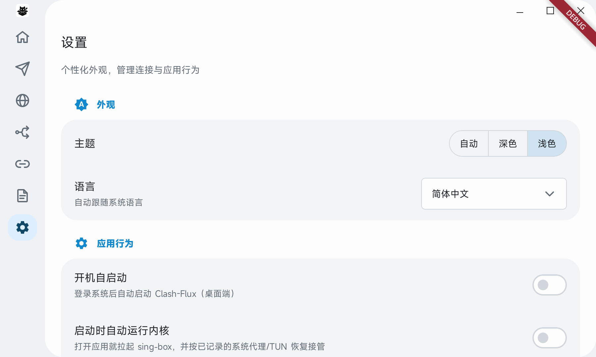
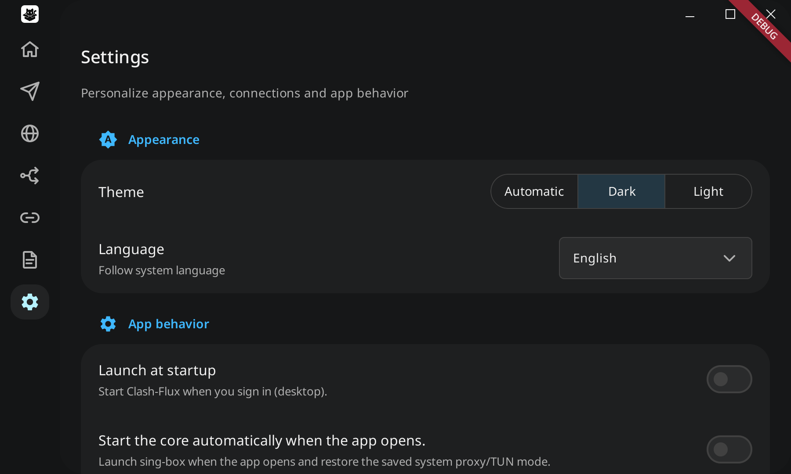

# Material Design 3 设置页

**2026-10-04 已按用户要求回退设置页重构。** 当前设置页恢复通用／内核／关于
布局、原有设置行、语言与关闭行为的分段选择器及原平台控件。以下设计、截图和
首次验证仅作为历史记录，不代表当前界面。共用标题布局、顶部栏底板、侧边栏及
`kDesktopTopContentGap` 均保留，设置页通过原有 `PageScaffold` 接入共用布局。
随后桌面一级页标题移入顶部自定义标题栏，设置页内容区不再占用独立标题行；
现行约定见 [UI 开发约定](ui-development.md)。

日期：2026-10-03。代码快照为 v0.3.19 的 `7bbc149c81b728f9e1717440a29fff447ba13fb0`
加本地未提交增量，本批未发布。

设置页按 Google Material Design 3 重新组织为外观、应用行为、代理与网络、
平台连接/运行、配置保真度（有记录时）、手机更多入口与关于。分组采用色调填充
卡片，图标与小标题标记类别；页标题 20、设置项标题 16、辅助说明 13–14，
分组间距 24、卡片圆角 24，桌面页面圆角 28。使用既有品牌主色与当前深浅主题，
选中容器从主色混入表面色，不另存一套主题偏好。设计参考
[Google 官方 Material 3 卡片说明](https://github.com/material-components/material-components-android/blob/master/docs/components/Card.md)。

各页标题共用 `page_layout.h`：标题行至少 48 高，标题统一 20 字号；桌面大卡片
顶部留白 4、标题水平留白 24。设置页不另加标题内边距。二级分页的内容页边距
仍按 `kSectionCardSpacing` 管理，不随标题边距改变。
页面到顶部自定义栏、一级侧边导航到 Logo 所在栏的间距共用
`ui.h` 中的 `kDesktopTopContentGap`，修改这一处即可同步调整。

2026-10-04 收敛标题布局：Linux 隔离数据目录中逐页启动首页、订阅、代理、规则、
连接、日志、设置并核对标题位置；分页交互回归 `page_transition` 通过。
下方设置页截图已更新为共用标题布局。本轮未执行手机或其它桌面平台实机验收。

设置页局部安装 HuxerUI MaterialTheme，采用框架 Switch、Outlined TextField、
胶囊 SegmentedButton 与 Select；主题保留分段选择，语言和关闭窗口行为用下拉，
避免英文长选项挤压说明。Android 出站模式保留原受控逻辑与运动轨道，改为 48 高
胶囊和分段描边。其它页面继续使用自己的组件样式，订阅表单的 SettingRow 不改。

宽屏阅读区最大 1040，普通控件靠右；小于 600 的窗口上下排列普通控件，
开关仍在说明右侧，设置行最小高度 72。手机保留底部导航遮挡留白与原
NavigationStack 的 push/pop 入口；平台权限和能力由原平台模块继续处理。
保真度账本保留展开全部及原始来源/明细，不显示空报告。

所有既有设置的 KV 名、模型写透、任务线程、模式切换回滚、端口范围与权限动作
保持原路径；没有修改数据库 schema、迁移、订阅文件或订阅写入口。
MaterialPreference / MaterialSettingsGroup / MaterialSettingsSurface 在
`src/ui/settings_material.h`，生产包装在 `common.cpp`，平台分组在
`platform_settings.cpp`。

## 验证

- `cmake --build build --target clash-flux test_page_transition`：包含 HuxerUI codegen。
- `./run.sh --version`：Clash-Flux 0.3.19。
- `ctest --test-dir build --output-on-failure --no-tests=error -L clashflux-required`：15/15。
  page_transition 复用生产 Material 布局，在深/浅色与 320/400/800/1440 四个宽度
  共八种组合中验证控件边界、72 行高、紧凑堆叠、最大阅读宽度及 Switch、分段按钮、
  长语言 Select 与 TextField 的真实事件/文字输入。
- Android `:app:assembleDebug --offline --no-daemon` 构建通过，未安装或真机交互验收。
- Linux `./run.sh` 使用独占 XDG_DATA_HOME 和 X11 后端启动，核对深色英文/浅色中文
  实际界面。测试主题/语言只在停止的隔离夹具内预置，未使用用户数据库。
  截图为 GUI 视觉检查，不把它写成 TUN/系统代理/远端线路验收。
- `git diff --check`；本批未执行 Windows/macOS 或 iOS 构建。

构建与回归日志前缀 `/tmp/clash-flux-settings-m3-`。预览：

